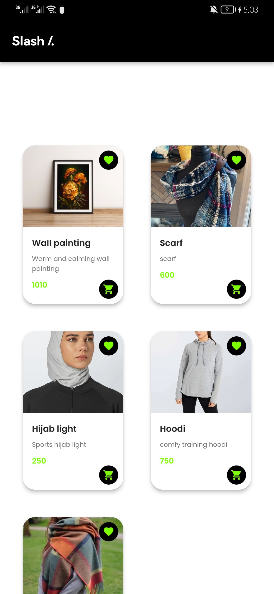

# slash

This project follows Clean Architecture principles with BLoC state management. It consists of Data, Domain, and Presentation layers.

# Architecture
Clean Architecture

- Data Layer: Handles data operations.
- Domain Layer: Contains business logic and use cases.
- Presentation Layer: Manages UI logic and interactions.
- BLoC Pattern with Cubit

Utilizes BLoC for business logic and Cubit for state management.

# Bug Description
Known UI rebuilding issue despite BLoC implementation. Unresolved as of now.

# Work in Progress
Progress made in Clean Architecture and BLoC. Future improvements, including constants and styles, planned post exams.

# Next Steps
Bug Fixing: Resolve UI rebuilding issue.
Code Refactoring: Enhance code quality.
Documentation: Improve understanding.
Optimizations: Implement performance improvements.
Additional Features: (If time permits) Add constants and styles.

